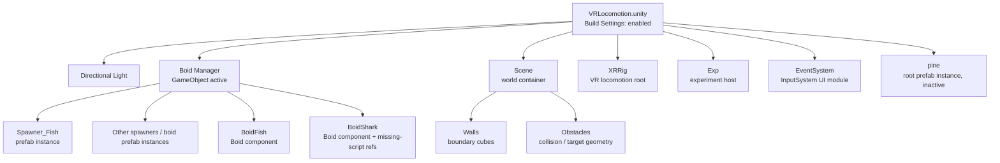
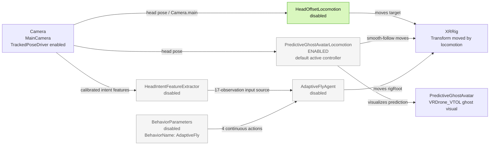
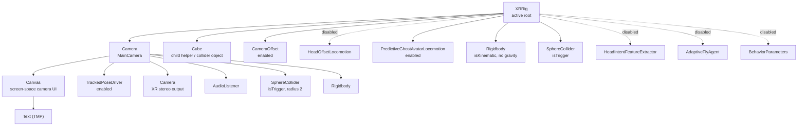
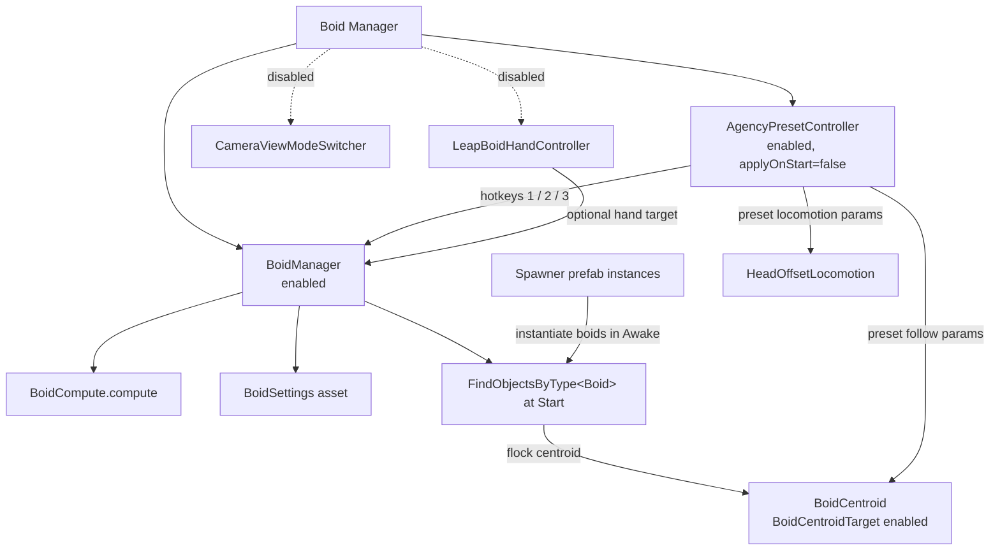
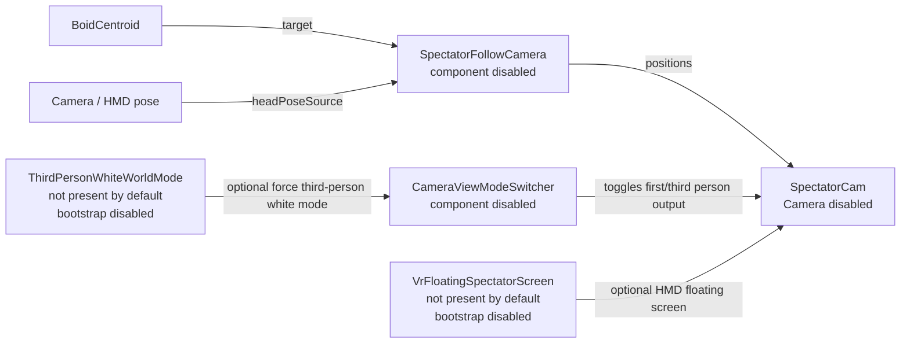
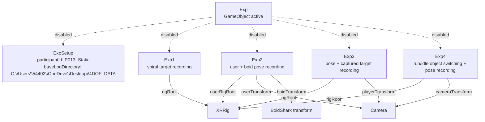

# VRLocomotion Scene Relationship Map

Scope: `Assets/Scenes/VRLocomotion.unity`.

This map reflects the serialized scene state, especially `m_IsActive` on GameObjects and `m_Enabled` on MonoBehaviours. The scene is the only enabled scene in `ProjectSettings/EditorBuildSettings.asset`.

## Top-Level Scene Layout

## Locomotion Control Stack

Important rule: only one of these should drive `XRRig` at a time. The scene currently uses `PredictiveGhostAvatarLocomotion`; keep `HeadOffsetLocomotion` disabled while testing it. `PredictiveGhostAvatarLocomotion` exposes `useKalmanPrediction`; leave it unchecked for the legacy acceleration/jerk-limited predictor, or check it to use the Kalman velocity/acceleration predictor. The predictive ghost visual is now driven by `GhostAvatarAnimationDriver`, which instantiates `Assets/Prefabs/VRDrone_VTOL.prefab` at runtime and disables the prefab's control, camera, light, and collider components.

## XRRig Hierarchy And Components

`HeadOffsetLocomotion.head` is serialized as null in the scene, so it resolves `Camera.main` in `Awake`. The RL and predictive ghost components serialize the camera transform explicitly.

## Boids And Agency Controls

`AgencyPresetController` can change boid flocking values, `HeadOffsetLocomotion` speed/yaw values, and `BoidCentroidTarget` smoothing at runtime. Because `applyOnStart` is false, it does not overwrite the serialized scene settings on startup.

## Spectator / Third-Person View Path

The scene contains `SpectatorCam`, but both its `Camera` component and `SpectatorFollowCamera` are disabled in the serialized state. `CameraViewModeSwitcher` is also present on `Boid Manager`, but disabled.

## Experiment Host

All experiment scripts are disabled in the scene. Their common keyboard convention is `S` to start and `Q` to stop or abort.

## Runtime Mode Summary

| Subsystem | Serialized state | Main role |
| --- | --- | --- |
| `HeadOffsetLocomotion` | Disabled | Legacy rig locomotion from head offset, pitch, and yaw |
| `PredictiveGhostAvatarLocomotion` | Enabled | Current predictive separation / ghost-follow locomotion |
| `AdaptiveFlyAgent` + `HeadIntentFeatureExtractor` | Disabled | ML-Agents residual or absolute locomotion policy |
| `BoidManager` | Enabled | Compute-shader boid flock update |
| `AgencyPresetController` | Enabled | Runtime preset hotkeys for boids, locomotion, centroid smoothing |
| `SpectatorCam` camera/follow | Disabled | Optional third-person spectator view |
| `Exp1` to `Exp4` | Disabled | Optional study logging modes |

## Notes / Risks

- `BoidShark` has two MonoBehaviour entries whose script GUID was not found in the project or package cache during inspection. Unity will likely show these as missing scripts.
- `HeadOffsetLocomotion`, `PredictiveGhostAvatarLocomotion`, and `AdaptiveFlyAgent` all write to the same `XRRig` transform. Enable exactly one primary locomotion driver for a clean run.
- `HeadOffsetLocomotion` and `HeadIntentFeatureExtractor` both use `C` as a recenter/calibrate key. If both are enabled together, that key has two meanings.
- The current scene has experiment setup data serialized but disabled. Enabling an experiment will reset the rig pose on start/stop according to each experiment script.
